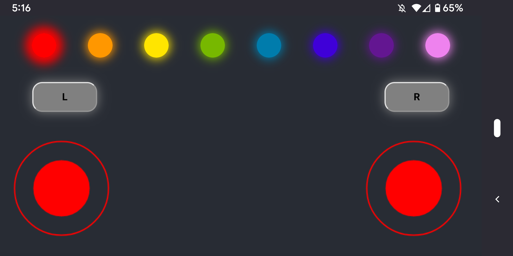
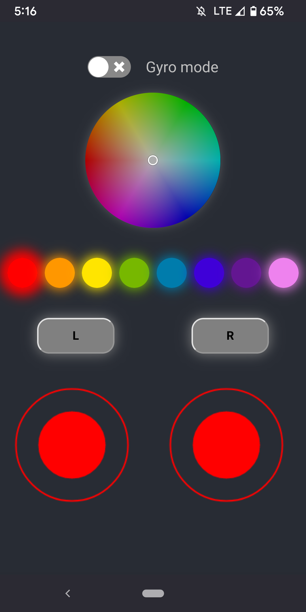

# Secret Fire Canopy JS Controller

Web app that interfaces with the Servants of the Secret Fire LED Canopy.





## Overview

A Create React App (CRA) Typescript app renders a React frontend, which connects to the Unity app's
websocket server and sends events (client -> server). A simple python websocket server can be used
to log the output from the React app.

## Development

### Setup

Ensure you have a recent version of Node (10 doesn't work, 16 does).

Install Javascript dependencies:

`npm install`

Install Python dependencies:

`cd websocketserver && pip3 install -r requirements.txt`

### Run

Run the React server:

`npm start`

Either run the canopy app, or run the python websocket server:

`npm run websocket`

Visit: http://localhost:3000/

### Tips

The React app looks for a websocket server using the following environment variables:

```
REACT_APP_WEBSOCKET_HOST=127.0.0.1
REACT_APP_WEBSOCKET_PORT=9431
```

These values get assigned default values in `.env`. To override them, create a file `.env.local` and
assign any overrides as desired. Re-run `npm start` to rebuild with the changed values.

## To do

- size joystick smartly
- smartly reconnect to websocket server

## Flask app

There is also a DatGUI frontend served by a Flask app, which allows setting and changing values in a
SQLite DB. The canopy Unity app polls the Flask app for data.

```
cd flaskapp
pip3 install -r requirements.txt
python3 main.py
```

Visit: http://localhost:5000/
